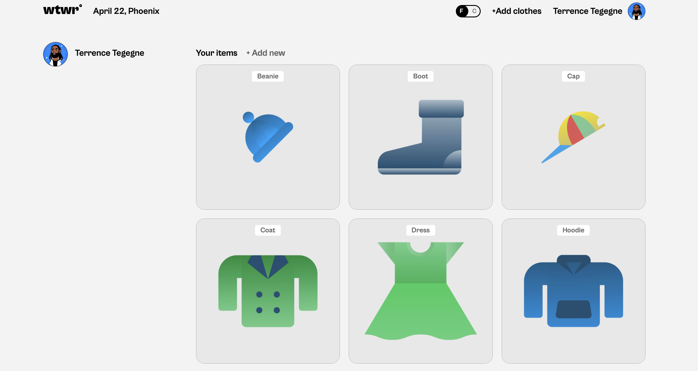

# Project 4: WTWR - Weather App

WTWR stands for "What to Wear." This app uses the weather for a user's location to display the current temperature and suggest clothing based on whether the weather is hot, warm, or cold. Users can also open a clothing preview modal and interact with the app through a clean React interface.

## Features

- 🌤️ Displays the current temperature for the user's location
- 🌡️ Toggles temperature units between Fahrenheit and Celsius
- 👕 Suggests clothing items based on the current weather type
- 🧥 Filters clothing cards by hot, warm, and cold weather
- 🖼️ Opens a clothing item preview modal when a card is selected
- ➕ Allows users to add new clothing items through a controlled form modal
- 🗑️ Allows users to delete clothing items with a confirmation modal
- 👤 Includes a profile page with client-side routing using React Router
- 🔄 Fetches, adds, and deletes clothing items through a mock API using `json-server`
- ⏳ Includes loading states for weather data and item deletion
- 🌙 Uses weather condition and day/night data to update the weather card

## Tech Stack

- React
- Vite
- JavaScript
- CSS
- React Router
- json-server
- OpenWeather API
- GitHub Pages

## Deployment

**🖥️Live Site:** [Click here to View Project Demo](https://ln-harris.github.io/se_project_react/)

Images of the site will go here:

**Full Desktop View**  

**Add Clothes Modal**  

**Preview Modal**  

**Profile Modal**  

## Plans for Improvement

- ⚠️ Improve API error handling with user-facing messages
- 📱 Add responsive design for mobile devices
- ✏️ Add support for editing clothing items
- 🔐 Add user authentication and profile management
- 🖌️ Change color of close button on cards

## Project Pitch Video

Check out this live recorded demo 🎥 where I describe my
project and some challenges I faced while building it.

- [Pitch Video](https://www.loom.com/share/563e9e809a5f4528bad4bda39f63ca28)
