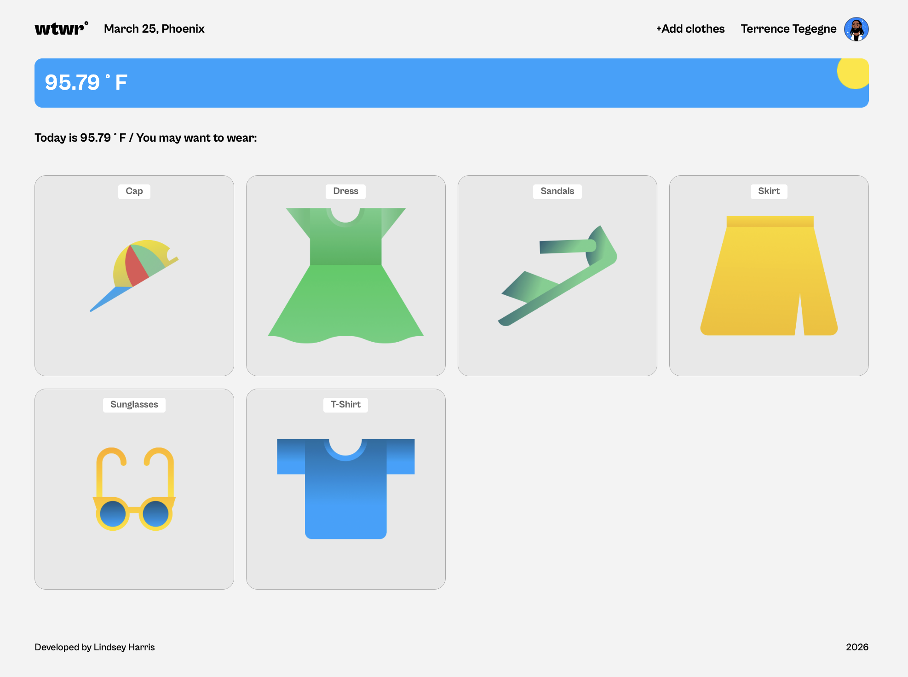
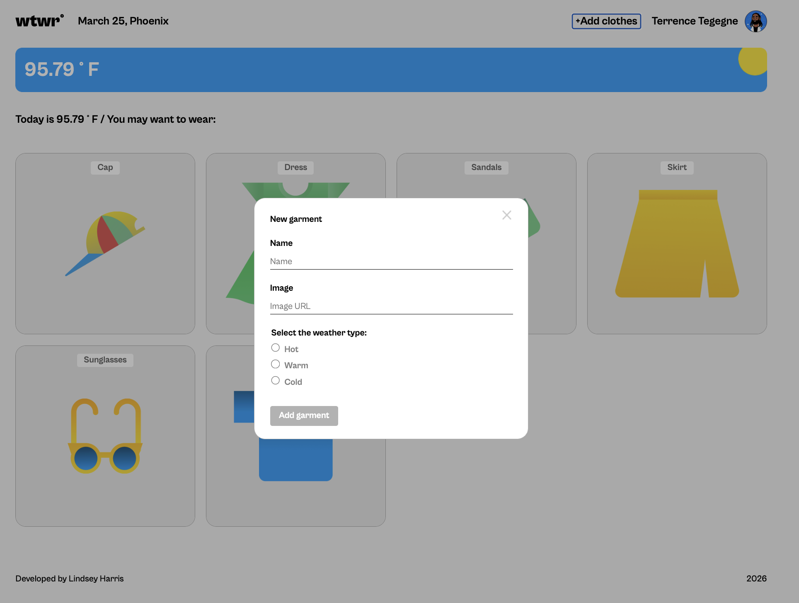
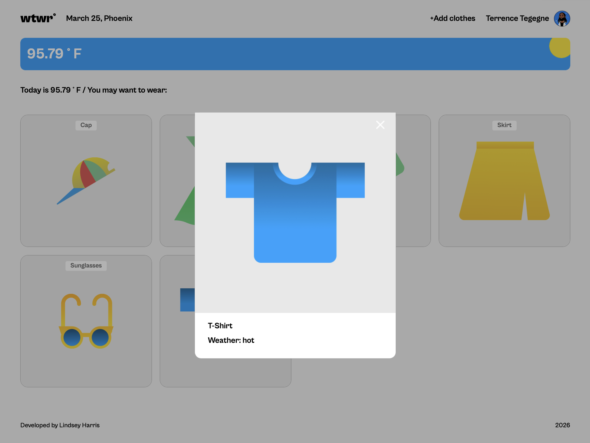

# Project 4: WTWR - Weather App

WTWR stands for "What to Wear." This app uses the weather for a user's location to display the current temperature and suggest clothing based on whether the weather is hot, warm, or cold. Users can also open a clothing preview modal and interact with the app through a clean React interface.

## Features

- 🌤️ Displays the current temperature for the user's location
- 👕 Suggests clothing items based on the current weather type
- 🧥 Filters clothing cards by hot, warm, and cold weather
- 🖼️ Includes a clothing item preview modal
- 🌙 Uses weather condition and day/night data to update the weather card

## Tech Stack

- React
- Vite
- JavaScript
- CSS
- OpenWeather API
- GitHub Pages

## Deployment

**🖥️Live Site:** [Click here to View Project Demo](https://ln-harris.github.io/se_project_react/)

Images of the site will go here:

**Full Desktop View**  

**Add Clothes Modal**  

**Preview Modal**  

## Plans for Improvement

- ➕ Add the ability for users to create and save their own clothing items
- ⚠️ Improve error handling and loading states for the weather API
- 📱 Add a more polished responsive design for mobile devices
- 🌗 Add light/dark mode
